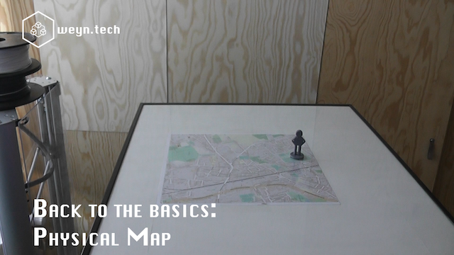

# Physical Map

Small project to turn GPS coordinations coming from Owntracks Android client via MQTT to this python script. Using this coordinate a position on an actually physical map is calculated.
Using g-code a 3D printer is controled. On top of the printer head a magnet controles a printed 3D icon on the map.

Watch the video on: https://youtu.be/h5TnZPk_MvU

